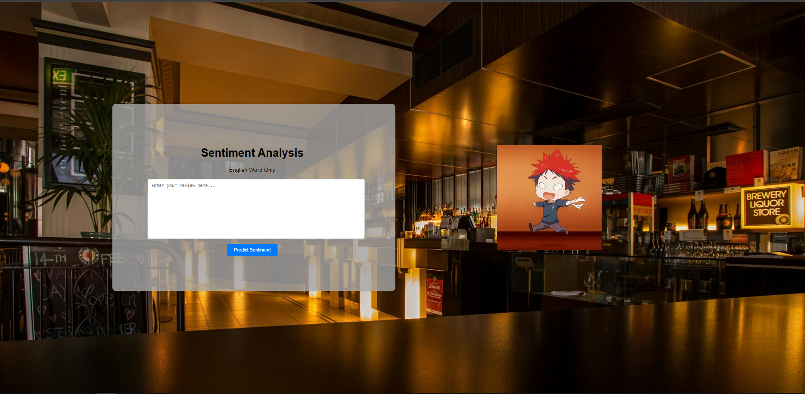
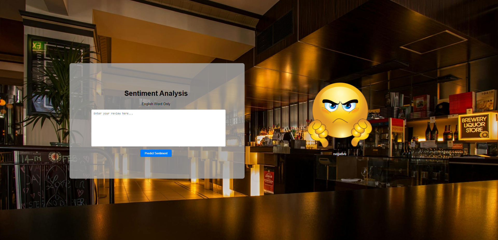
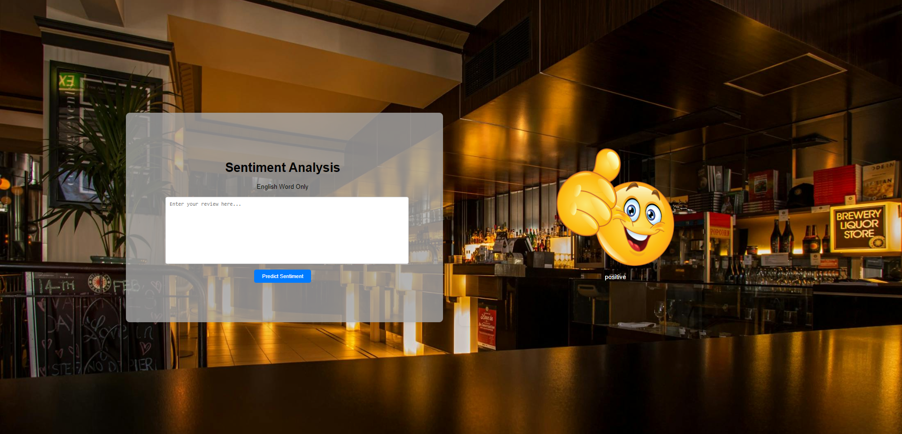

# DMML24-ProjectTASK
Kelompok 14 :
1. Muhammad Rayhan Farizi - H071201052
2. Muhammad Affandi - H071201094

# How to Run the Application
1. Fork this repo and clone to your device
   ```sh
   git clone <url-repositori-hasil-fork>
2. or you can just download it
3. To run it, open terminal in the folder that has been cloned and run the app.py
   ```sh
   python app.py

# Application Display






